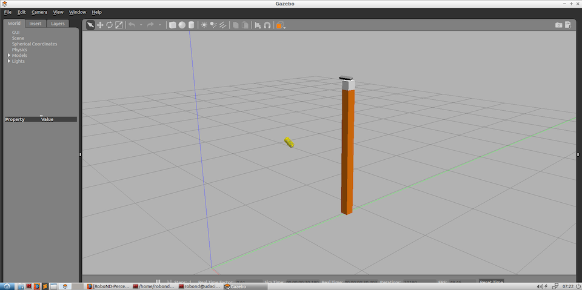
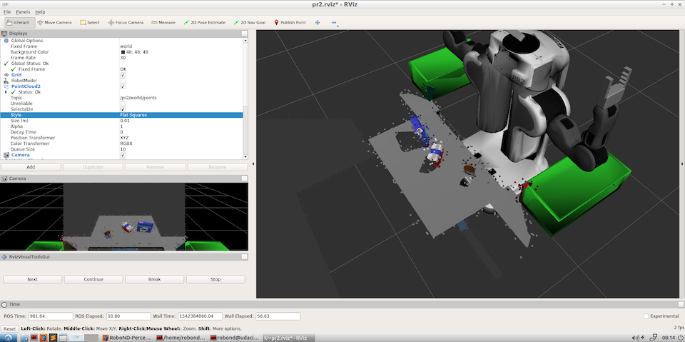
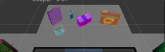
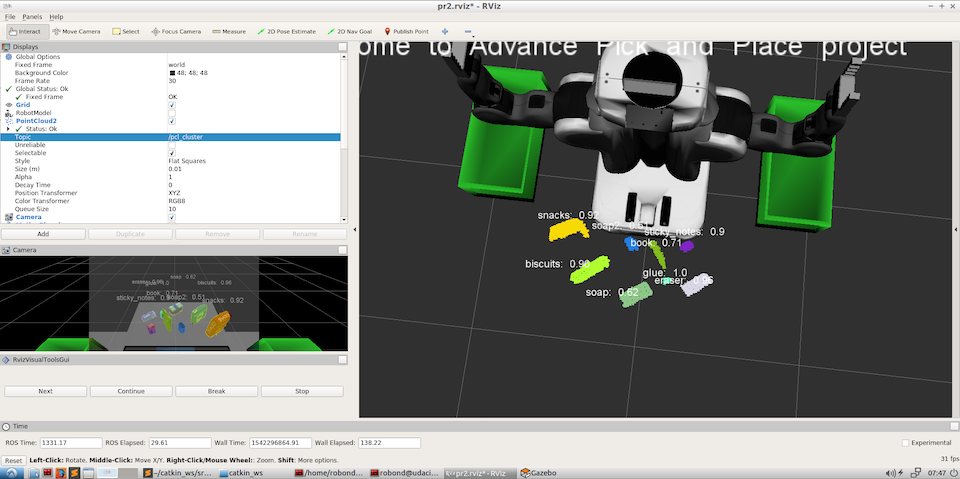
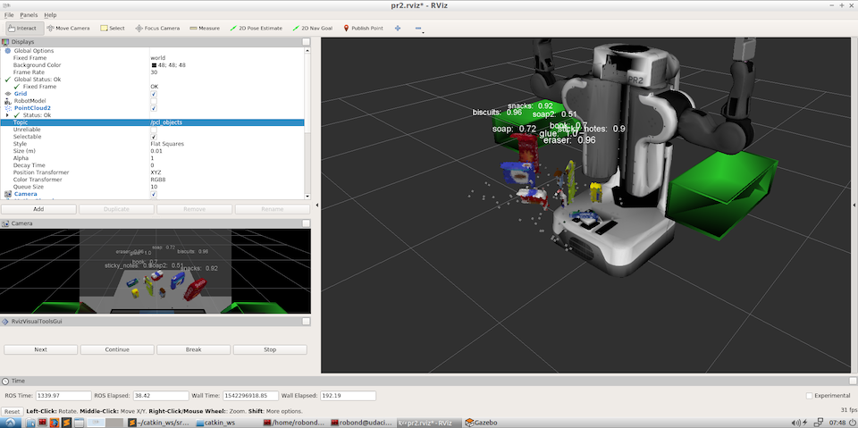

# Project: Perception Pick & Place
In this project, a robot will be trained to detect and label objects found on top of a table. The robot is equipped with an RGBD camera that can generate color and positional data about the objects it sees, and store this data as point clouds. The robot software can then process the point clouds by filtering out noise and detecting clusters, and then classify clusters using a pre-trained SVM classifier. The SVM itself is trained by showing the robot camera multiple objects at various angles, and collecting histographic data about each object from its color-space and feature normals.
---
## Installation and Setup
### Requirements
In order to run the Robotic Perception program, you should use computer running Linux 16.04 LTS with the following software installed:
- ROS Kinetic
- A Catkin Workspace
- `python-pcl`, a Python extension of the `PCL` package

### Install Sensor_Stick
Before we can classify the objects the robot sees, we have to first train an SVM classifier on those objects. The first step is to clone a copy of the Percepion Exercise directory from Udacity's RoboND Github Respository. From a terminal, the command would be:
```
$ git clone https://github.com/udacity/RoboND-Perception-Exercises.git
```
Navigate to the `Exercise-3` folder and copy the `sensor_stick` folder to the directory `~/catkin_ws/src`. The `sensor_stick` folder contains the ROS packages and scripts we need to generate multiple samples of the objects we want to classify in front of an RGBD camera. We then extract features from these samples and use the features to train an SVM.
In order to use the `sensor_stick` packages, open a terminal and issue the following commands:
```
$ cd ~/catkin_ws
$ rosdep install --from-paths src --ignore-src --rosdistro=kinetic -y
$ catkin_make
```
Also, make sure to include the following in your `.bashrc` file:
```
export GAZEBO_MODEL_PATH=~/catkin_ws/src/sensor_stick/models
source ~/catkin_ws/devel/setup.bash
```
The python code to extract features from objects and train an SVM are located in different places inside the `sensor_stick` folder. The three files most relevant to feature extraction are
(assuming you are in the `Exercise-3` folder):
- `/sensor_stick/src/sensor_stick/features.py`
- `/sensor_stick/scripts/train_svm.py`
- `/sensor_stick/scripts/capture_features.py`

If you have just cloned the repository, then the feature extraction and training code is incomplete, and we must fill them in.

#### Feature Extraction
The first file, `features.py`, contains the functions to extract histogram features from a point-cloud object. There are two main functions in this file. First,the function `compute_color_histograms(cloud, using_hsv)`, located on line 13, takes in a point cloud and a boolean that indicates if the user wants to use the HSV color space. Each point in the point cloud is converted to either an RGB or an HSV 3-tuple value and then added to a list. Next, the function separates the list of RGB or HSV values into separate channels (one for each color layer) and creates histograms based on those separate channels. Note that each bin of the histogram constitutes a data feature. The second function `compute_normal_histograms(normal_cloud)`, takes a point cloud that has been processed to contain information about the objects surface normal (a vector that points perpendicular to the plane that is tangent to the object at that point). This function creates histograms based on the XYZ components of the surface normal, with each bin once again representing a feature.

Here, choosing the number of bins for the histogram influences the classifiers performance. If you include too few, then the classifier may not have enough distinguishing features to make accurate predictions. However, if you include too many, then the pattern inherent in the object gets lost as the histogram becomes very granular (i.e. only a few samples in each bin). I found that setting a bin number of 10 worked well for both the color and normal histogram functions.

#### Capture Features
After the feature extraction functions in `features.py` are completed, we can capture features for each object by running the `capture_features.py` file located in `sensor_stick/scripts`.
When we open `capture_features.py`, we see that there is a list called `models` that contains the name of the objects we want to identify. We can find the names of the object in `yaml` files that I will describe later. For now, we can include the following objects:
```python
models = [
          'sticky_notes',
          'book',   
          'snacks',  
          'biscuits',    
          'eraser',    
          'soap2',   
          'soap',  
          'glue'
          ]
```
The only other part of this script we need to fill out is the number in `range()` in the for loop on line 44. This tells us how many samples of each object we want to generate, with each sample at a different angle. The script will call the color and normal histogram functions described earlier to extract features from each sample. The features of subsequent samples are concatenated together into a larger feature array. The labels for each object (the object name) are also concatenated together in a corresponding labels array.

The number of samples to generate for each object can affect the final results. The more samples we include, the more data the SVM can train on. This is generally a good thing. However, it will obviously make the feature capturing step longer. I found that 40 samples of each object (so set `range(40)` inside the for loop) was sufficient.

Finally, once we are ready to run the script, we open a terminal and navigate to the `catkin_ws`:
```
$ cd ~/catkin_ws
```
Then, we start an instance of Gazebo with the sensor stick by issuing this command:
```
$ roslaunch sensor_stick training.launch
```
and then we run the script by issuing:
```
$ rosrun sensor_stick capture_features.py
```
This opens Gazebo with a RGBD camera on top of a post. Each object in `models` will be generated in front of the camera multiple times (equal to the number given to `range()`), and each time at a different angle. 



#### Train the SVM
Running the `capture_features.py` script will generate a file called `train_set.sav` that includes the feature and label array of our object samples. To train the SVM, we have to run `train_svm.py`. I did not change much in this script although I did try different versions of the SVM using different kernels. I found that the linear kernel still worked best. I also set the argument `probability` to `True` so that I could see how confident the classifier was for its predictions. The classifier is defined on line 65. To run the training, open a terminal and issue the command:
```
$ rosrun sensor_stick train_svm.py
```
Two confusion matrices will appear showing you the detection accuracy of each object. If you are happy with the results, then you can move on to the Perception portion of this project.


### Install the Perception Project
Clone the perception project Github repository by opening a terminal and issuing these commands:
```
$ cd ~/catkin_ws/src
$ git clone https://github.com/udacity/RoboND-Perception-Project.git
```
Next, build the project:
```
$ cd ~/catkin_ws
$ catkin_make
```
and add the PATH dependency to your `.bashrc` file:
```
export GAZEBO_MODEL_PATH=~/catkin_ws/src/RoboND-Perception-Project/pr2_robot/models:$GAZEBO_MODEL_PATH
```
In order to run the simulation, open a terminal and issue the following commands:
```
$ cd ~/catkin_ws
$ roslaunch pr2_robot pick_place_project.launch
```
This will open a Gazebo and an RViz window that shows the robot, two bins on either side of the robot, and a table with objects on the table. The number and type of objects on the table depend on the settings in the `pick_place_project.launch` file located in the `~/catkin_ws/src/RoboND-Perception-Project/pr2_robot/launch` folder. The lines of interest are lines 13 and 39. In line 13, it is the `test*.world` file that determines what objects are shown on the table. Choose from one of three options `test1`, `test2`, or `test3`. Then, in line 39, it is the `pick_list_*.yaml` file that contains the names of the objects and the bins (left or right) in which they should be placed. Choose from one of three options `pick_list_1.yaml`, `pick_list_2.yaml`, `pick_list_3.yaml`. For example, the contents ofr `pick_list_3.yaml` looks like this:
```python
object_list:
  - name: sticky_notes
    group: red
  - name: book
    group: red
  - name: snacks
    group: green
  - name: biscuits
    group: green
  - name: eraser
    group: red
  - name: soap2
    group: green
  - name: soap
    group: green
  - name: glue
    group: red
```

At last, with the installation and setup out of the way, we can start constructing the perception pipeline. We will be working with the `project_template.py` file to construct the perception pipeline. The file can be located at:
`~/catkin_ws/src/RoboND-Perception-Project/pr2_robot/scripts/`

## Building the Perception Pipeline
### Setting up Node and Subscriber
To initialize and setup communication with the ROS program, we first create a ROS node and a subscriber. The program does this in lines 300 to 304. 

```python
# TODO: ROS node initialization
rospy.init_node('clustering', anonymous=True)
```

The subscriber is getting messages from the  `/pr2/world/points` topic, which sends out the readings from the robot camera.

```python
# TODO: Create Subscribers
pcl_sub = rospy.Subscriber("/pr2/world/points", pc2.PointCloud2, pcl_callback, queue_size=1)
```

The call back function in the subscriber is `pcl_callback()` and it is inside this function where we build our perception pipeline. Therefore, all the following steps occur within `pcl_callback()`.

### Filtering Noise
The robot camera is very noisy and will display detection points floating in the air around the objects.



Since noise will impact our detection accuracy, we have to use Statistical Outlier Filtering to remove it. This function is done in lines 52 to 64 of `project_template.py` within the `pcl_callback()` function. The program calculates a global mean of the distances of each point in the point cloud to its neighbors. A point is considered an outlier if the distance to its neighboring points is greater than this global mean by a defined threshold. The parameters that we can adjust to affect the performance of this outlier filtering are the number of neighboring points to consider when calculating the mean and the threshold distance that defines the boundary between what is considered an inlier and an outlier. In line 58, we can set the number of neighboring points to consider by adjusting the number inside the `kmeans()` function:

```python
# Set the number of neighboring points to analyze for any given point
cloud_filter.set_mean_k(50)
```

The threshold distance is set in line 60:
```python
# Set threshold scale factor
x = 0.2
```

If we set the threshold factor small, then we are likely to remove more outlier points, but we will also potentially remove inlier points that are still part of a valid object but is somewhat farther apart from the rest of its neighbors. On the other hand, if we increase the threshold, then we will be more likely to capture all the inlier points, but will also include more outlier noise. Through experimentation with various threshold values, I found that a value of `0.2` provided a good balance between filtering out outliers while still keeping most of the inlier points.

### Passthrough Filter
In this step, we narrow the area of interest for object detection. The program does this by limiting the detection regions along a cartesian (XYZ) axis. For example, since we are only interested in the objects on the table, and the Z axis runs from the ground to the ceiling, then we can set the Z-axis limits to include just the objects on top of the table. This is done in lines 80 to 87, where through experimentation, I found the axis min to be 0.6 and the max to be 1.1. The second axis we should filter is along the Y-axis, which runs from the left to right of the robot. We want to limit the detection region so that it excludes the two bins to the right and left of the robot. The program does this in lines 93 to 100, where we limit the Y-axis region to be within -0.4 to 0.4.
```python
# TODO: PassThrough Filter
# Create a PassThrough filter object.
passthrough = cloud_filtered.make_passthrough_filter()

# Assign axis and range to the passthrough filter object.
filter_axis = 'z'
passthrough.set_filter_field_name(filter_axis)
axis_min = 0.6
axis_max = 1.1
passthrough.set_filter_limits(axis_min, axis_max)

# Finally use the filter function to obtain the resultant point cloud. 
cloud_filtered = passthrough.filter()

# Create a PassThrough filter object.
passthrough = cloud_filtered.make_passthrough_filter()

# Assign axis and range to the passthrough filter object.
filter_axis = 'y'
passthrough.set_filter_field_name(filter_axis)
axis_min = -0.4
axis_max = 0.4
passthrough.set_filter_limits(axis_min, axis_max)

# Finally use the filter function to obtain the resultant point cloud. 
cloud_filtered = passthrough.filter()
```

### RANSAC for Plane Detection
The RANSAC algorithm separates the table from the object. It finds the equation for a plane that fits the table and then separates out the plane from objects that are farther than a defined threshold. The program does RANSAC from lines 105 to 126. I set a threshold distance of `0.01` so that points that are farther than that distance from the plane are considered outliers. In this case, outliers are points that make up the objects sitting on top of the table where the plane was fitted.
```python
# TODO: RANSAC Plane Segmentation
# Create the segmentation object
seg = cloud_filtered.make_segmenter()

# Set the model you wish to fit 
seg.set_model_type(pcl.SACMODEL_PLANE)
seg.set_method_type(pcl.SAC_RANSAC)

# Max distance for a point to be considered fitting the model
# Experiment with different values for max_distance 
# for segmenting the table
max_distance = 0.01
seg.set_distance_threshold(max_distance)

# Call the segment function to obtain set of inlier indices and model coefficients
inliers, coefficients = seg.segment()

# TODO: Extract inliers and outliers
# Extract inliers
cloud_table = cloud_filtered.extract(inliers, negative=False)
# Extract outliers
cloud_objects = cloud_filtered.extract(inliers, negative=True)
```

### Clustering for Segmentation
Once we isolate the point clouds for the objects, we can use clustering techniques to separate individual objects. This program uses Euclidean Clustering, which means that it uses the euclidean (square root of the difference of squares) distance between points to determine if they belong in the same cluster. PCL specifically uses k-d trees, which is a type of a binary search tree, to find K Nearest Neighbors of a point. The parameters that affect the clustering performance are the tolerances for distances, and the minimum and maximum number of points in a cluster. These parameters are set in lines 138 to 140. As with the parameters in the other parts of the pipeline, we have to make a tradeoff between including points that do not belong to an object and excluding points that do belong. From experimentation, I found the following worked well:

```python
# Set tolerances for distance threshold 
# as well as minimum and maximum cluster size (in points)
ec.set_ClusterTolerance(0.02)
ec.set_MinClusterSize(50)
ec.set_MaxClusterSize(2000)
```

Setting the distance tolerance to 0.02 eliminated any overlap between two separate objects and setting the minimum cluster size to 50 allowed for the detection of small objects like the glue, while also being large enough to not include detection of noise.

For visualization purposes, I gave a different color to each detected cluster. This is done from lines 148 to 163, which loops through each cluster detected and assigns a different color to each cluster.
```python
# TODO: Create Cluster-Mask Point Cloud to visualize each cluster separately
#Assign a color corresponding to each segmented object in scene
cluster_color = get_color_list(len(cluster_indices))

color_cluster_point_list = []

for j, indices in enumerate(cluster_indices):
    for i, indice in enumerate(indices):
        color_cluster_point_list.append([white_cloud[indice][0],
                                          white_cloud[indice][1],
                                          white_cloud[indice][2],
                                          rgb_to_float(cluster_color[j])])

#Create new cloud containing all clusters, each with unique color
cluster_cloud = pcl.PointCloud_PointXYZRGB()
cluster_cloud.from_list(color_cluster_point_list)
```

### Publish Clusters to ROS
At this stage, we have point clouds for the table, the objects on top of the table, and different-colored clusters around each individual object. These are still point cloud objects and in order to see them in RViz, we have to convert them to ROS objects and publish them to the correct topics. We have to setup the publishers first inside the `main` caller, as I do in lines 306 to 310.

```python
# TODO: Create Publishers
# Detection and clustering publishers
pcl_objects_pub = rospy.Publisher("/pcl_objects", PointCloud2, queue_size=1)
pcl_table_pub = rospy.Publisher("/pcl_table", PointCloud2, queue_size=1)
pcl_cluster_pub = rospy.Publisher("/pcl_cluster", PointCloud2, queue_size=1)
```

We can access these publishers inside `pcl_callback()` and pass them the ROS messages we converted from the PCL point clouds.
```python
# TODO: Convert PCL data to ROS messages
ros_cloud_objects =  pcl_to_ros(cloud_objects)
ros_cloud_table = pcl_to_ros(cloud_table)
ros_cluster_cloud = pcl_to_ros(cluster_cloud)

# TODO: Publish ROS messages
pcl_objects_pub.publish(ros_cloud_objects)
pcl_table_pub.publish(ros_cloud_table)
pcl_cluster_pub.publish(ros_cluster_cloud)
```

In RViz, you can see the clusters by checking PointCloud2 on the left-side panel and then selecting the `/pcl_cluster` topic. From the robot camera's perspective, you would see the objects on the table with coloring showing where the clusters are. This is an example from `test2.world`:


## Extracting Features and Object Detection
### Feature Extraction
We have the clusters, hopefully around each object located on top of the table. We iterate through each cluster and convert it from a point cloud object to a ROS object. Now we can extract features from the cluster by using the `compute_color_histogram()` and the `compute_normal_histogram()` functions we discussed earlier. For the former function, we are working in the HSV space for better detection. We concatenate both the outputs of both functions as one feature set and use the model we trained earlier to classify the object. Recall that we trained an SVM classifier on multiple samples of the objects on the table and saved the results in a `model.sav` file. We should move that file to the `~/catkin_ws/src/RoboND-Perception-Project/pr2_robot/scripts/` folder. Now we can load the classifier from that file and use it to label our cluster. Within the code, I do this in lines 182 to 198.

```python
for index, pts_list in enumerate(cluster_indices):
  
  # Grab the points for the cluster
  pcl_cluster = cloud_objects.extract(pts_list)
  ros_cluster = pcl_to_ros(pcl_cluster)

  # Compute the associated feature vector
  chists = compute_color_histograms(ros_cluster, using_hsv=True)
  normals = get_normals(ros_cluster)
  nhists = compute_normal_histograms(normals)
  feature = np.concatenate((chists, nhists))

  # Make the prediction
  prediction = clf.predict(scaler.transform(feature.reshape(1,-1)))
  prob = clf.predict_proba(scaler.transform(feature.reshape(1,-1)))
  label = encoder.inverse_transform(prediction)[0]
  max_prob = round(np.max(prob), 2)
```

### Object Detection
As a safeguard against weak classification, I calculate the probability associated with the classifier's label. I require that the classifier be at least 50% confident that its label is correct.
If it is, then we publish the label and its probability to RViz using the `object_markers_pub` publisher. The publisher must be created, along with the other publishers, inside the `main` caller.

```python
object_markers_pub = rospy.Publisher("/object_markers", Marker, queue_size=1)
```

Then we publish to the `/object_markers` topic with the label and the position inside RViz that the label should be placed.

```python
# Publish a label into RViz
label_pos = list(white_cloud[pts_list[0]])
label_pos[2] += .4
object_markers_pub.publish(make_label(label + ': ' + str(max_prob),label_pos, index))
```

The labels will show up in RViz floating above their respective objects.



Here is another view, without the cluster colors, so that the objects are shown more clearly.



Next, we want to create a special object that is part of the `sensor_stick` package called `DetectedObject`. We can set the label and cluster associated with the object to an instance of `DetectedObject` and add it a list of the objects we have detected and labeled so far. This list of detected objects gets passed to the pick and place function called `pr2_mover()`.


## Pick and Place Setup
At this stage, we have a list of the detected objects and their respective labels. We now want to create a request to a pick and place server to perform the pick and place operation. The format of the service message we have to create is defined in the `pr2_robot/srv/PickPlace.srv` file. Specifically, we have to generate the following messages:

```
# request
std_msgs/Int32 test_scene_num
std_msgs/String object_name
std_msgs/String arm_name
geometry_msgs/Pose pick_pose
geometry_msgs/Pose place_pose
---
```

Each message type has its own content structure. You can view that structure by typing:
```
$ rosmsg info *
```
in a terminal, where the * is replaced with the message type. For example, we can find out more about the Pose message by typing:
```
$ rosmsg info geometry_msgs/Pose
```
and we would get back:
```
geometry_msgs/Point position
  float64 x
  float64 y
  float64 z
geometry_msgs/Quaternion orientation
  float64 x
  float64 y
  float64 z
  float64 w
```
We see that we have to provide values for at least the `position.x`, `position.y`, and `position.z` values.
We will now read in a list of the objects we are expected to find and see if they are in the list of objects we detected. If so, then we calculate the centroid of the object and construct a message that would be a valid `pick_place` request. These steps are part of the `pr2_mover()` function, which takes the detected objects list as input. 

### Setup the Request Messages
First we initialize the ROS request messages.

```python
# TODO: Initialize variables
test_scene_num = Int32()
test_scene_num.data = 1
object_name = String()
arm_name = String()
pick_pose = Pose()
place_pose = Pose()
```

Note that these are specified in the `PickPlace.srv` file as we discussed earlier. Also note that for String() messages, we have to fill in the data filed. For example, since this is test world 1, we have

```
test_scene_num = Int32()
test_scene_num.data = 1
```

### Calculate Object Centroids
Starting from line 244, we read in the list of objects we are expected to find.

```python
# TODO: Get/Read parameters
object_list_param = rospy.get_param('/object_list')
place_pose_param = rospy.get_param('/dropbox')
```

The file that contains these objects come from `pick_list_*.yaml`. The `dropbox.yaml` file contains the locations of the center of the two bins. 
We then loop through the list of detected objects, extract the object labels, and calculate the centroid from the object's point cloud.
```python
# TODO: Get the PointCloud for a given object and obtain it's centroid
for object_ in object_list:
  label_list.append(object_.label)
  points_arr = ros_to_pcl(object_.cloud).to_array()
  centroid = np.mean(points_arr, axis=0)[:3]
  centroid = [np.asscalar(p) for p in centroid]
  centroid_list.append(centroid)
```

### Construct Request Message
Now, starting from line 256, we loop through the pick list and see if we can find the object name in our labels list. If we can, we read the centroid coordinates of that object and construct our pick_pose Pose() message. We then check the `pick_list_*.yaml` file to see if the object should be placed in the left or right bin. We read the correct place coordinates from the `dropbox.yaml` file and construct our place_pose Pose() message.

```python
# TODO: Loop through the pick list
for i in range(len(object_list_param)):
  object_name.data = object_list_param[i]['name']

  try:
    idx = np.where(np.array(label_list) == object_list_param[i]['name'])[0]
    centroid = centroid_list[idx[0]]
    pick_pose.position.x = centroid[0]
    pick_pose.position.y = centroid[1]
    pick_pose.position.z = centroid[2]
    if (object_list_param[i]['group'] == 'green'):
      # TODO: Assign the arm to be used for pick_place
      arm_name.data = 'right'
      # TODO: Create 'place_pose' for the object
      arm = 1	    	
    elif (object_list_param[i]['group'] == 'red'):
      arm_name.data = 'left'
      arm = 0
    place_pose.position.x = place_pose_param[arm]['position'][0]
    place_pose.position.y = place_pose_param[arm]['position'][1]
    place_pose.position.z = place_pose_param[arm]['position'][2]
```

Note that we also set the object_name and arm_name messages too.
After the messages are constructed, we create a yaml dict of these messages and append them to a list of these dictionaries.

```python
# TODO: Create a list of dictionaries (made with make_yaml_dict()) for later output to yaml format
yaml_dict = make_yaml_dict(test_scene_num, arm_name, object_name, pick_pose, place_pose)
dict_list.append(yaml_dict)
```

Lastly, on line 284, we construct the file that will be sent to the server.
```python
# TODO: Output your request parameters into output yaml file
send_to_yaml('output_1.yaml', dict_list)
```

Here is an abbreviated example of what the file contents look like for test world 1:
```python
object_list:
- arm_name: right
  object_name: biscuits
  pick_pose:
    orientation:
      w: 0.0
      x: 0.0
      y: 0.0
      z: 0.0
    position:
      x: 0.5423738360404968
      y: -0.24292367696762085
      z: 0.7057805061340332
  place_pose:
    orientation:
      w: 0.0
      x: 0.0
      y: 0.0
      z: 0.0
    position:
      x: 0
      y: -0.71
      z: 0.605
  test_scene_num: 1
```

## Project Discussion and Further Steps
The project was a great introduction to the practice of Robotic Vision and Object Detection. I got a good sense of what design considerations a robotics engineer should know in order to optimzier object detection performance. I also came across difficulties in getting the classifier to strongly distinguish various objects such as the soaps. With more tweaking of the SVM, I could make the detetion of those objects even stronger. Although I was not able to complete the challenge in time, my next step would be to process the requst messages my program created and then actually have the robot pick the objects off the table and place them in the bins. This would require the extra challenges of collision avoidance and kinematics.

